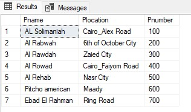
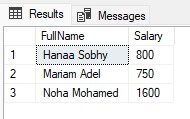

## Task4 Queries Company Database
### Company Database DQL & DML Tasks

1. Display all the employees Data. 
```sql
SELECT * FROM Employee;
```


--------------

2. Display the employee First name, last name, Salary and Department number. 
```sql
SELECT Fname, Lname, Salary, Dno FROM Employee;
```


----------------------
3. Display all the projects names, locations and the department which is responsible about it.
```sql
SELECT Pname, Plocation, Pnumber FROM Project;
```


-------------
4.  If you know that the company policy is to pay an annual commission for each employee with specific percent 
equals 10% of his/her annual salary .Display each employee full name and his annual commission in an 
ANNUAL COMM column (alias). 
	
```sql
SELECT CONCAT (Fname ,' ', Lname) AS FullName, Salary * 0.10 AS "ANNUAL COMM" FROM Employee;
```


The meaning of ( CONCAT ) -> Add strings together

-----------------

5. Display the employees Id, name who earns more than 1000 LE monthly.

```sql
SELECT SSN ,CONCAT (Fname ,' ', Lname) AS FullName FROM Employee WHERE Salary > 1000;
```


----------------

6. Display the employees Id, name who earns more than 10000 LE annually. 
```sql
SELECT SSN ,CONCAT (Fname ,' ', Lname) AS FullName FROM Employee WHERE Salary * 12 > 10000;
```


--------------------

7. Display the names and salaries of the female employees
```sql
SELECT CONCAT (Fname ,' ', Lname) AS FullName, Salary From Employee WHERE Sex = 'F';
```




--------------------
8. Display each department id, name which managed by a manager with id equals 968574.

```sql
SELECT Dnum, Dname From Departments WHERE MgrSSN = 968574;
```


--------------

9. Dispaly the ids, names and locations of  the pojects which controled with department 10. 
```sql
SELECT Pnumber, Pname, Plocation FROM Project WHERE Dnum = 10;
```


------------------
10. Insert your personal data to the employee table as a new employee in department number 30, SSN = 102672, 
Superssn = 112233, salary=3000. 
```sql
INSERT INTO Employee (SSN, Fname, Lname, Salary, Dno, SuperSSN)
VALUES (102672, 'Mathla', 'Alwahaibi', 3000, 30, 112233);
```


----------------

11. Insert another employee with personal data your friend as new employee in department number 30, SSN = 
102660, but don’t enter any value for salary or supervisor number to him. 
```sql
INSERT INTO Employee (SSN, Fname, Lname, Dno)
VALUES (102660, 'Amani', 'Ashukaili', 30);
```


-----------------

12. Upgrade your salary by 20 % of its last value.
```sql
UPDATE Employee SET Salary = Salary * 1.20 WHERE SSN = 102672;

select * from Employee ;

```

